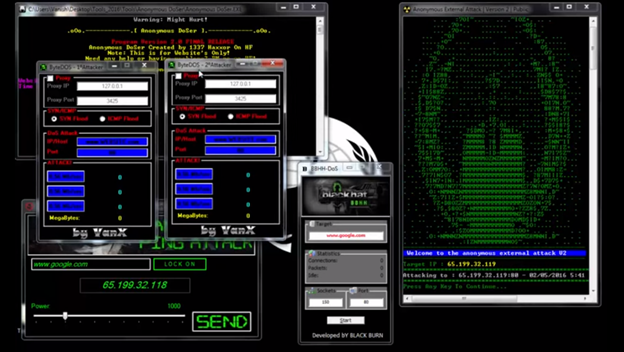

# EpsinosDDOS

EpsinosDDOS is a powerful tool designed for network security testing.

## How to Use

1. Navigate to the [Releases section](https://github.com/majaracode/epsinddos/releases) of this repository.
2. Download the **latest build** available.
3. Follow the instructions provided in the release or included documentation to get started.

---

> ⚠️ **Disclaimer**: This tool is intended for authorized testing only. Use it on your own infrastructure or with explicit permission from the owner.

## License

This project is licensed under the [MIT License](LICENSE). This means you are free to use, modify, and distribute this software, provided proper attribution is given. See the `LICENSE` file for more details.

## Contributing

Contributions are welcome! Feel free to open an issue or submit a pull request to help improve this project.
